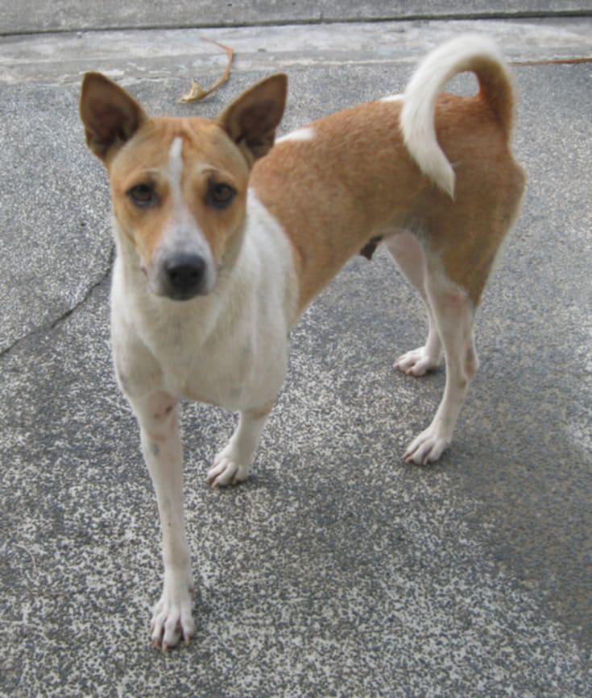
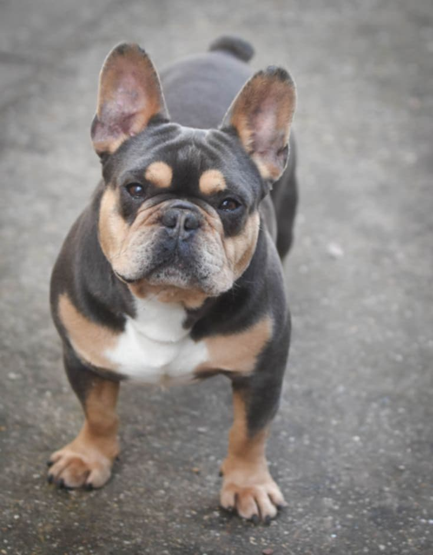
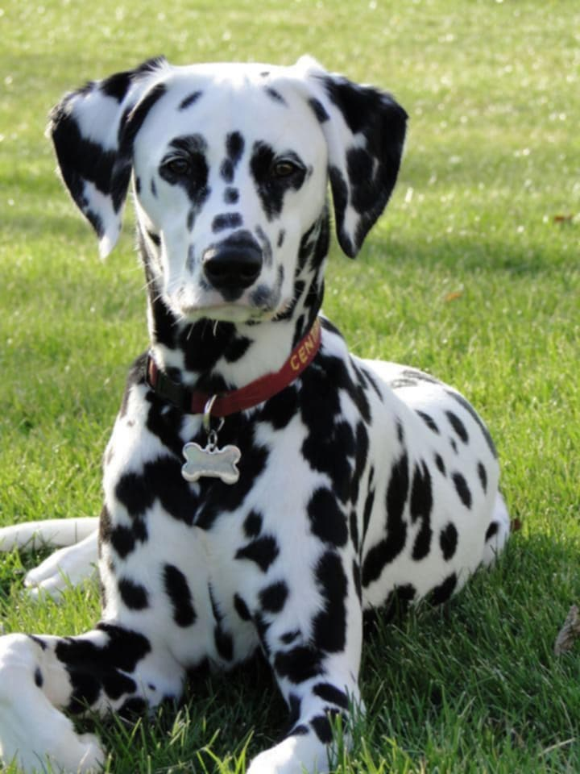
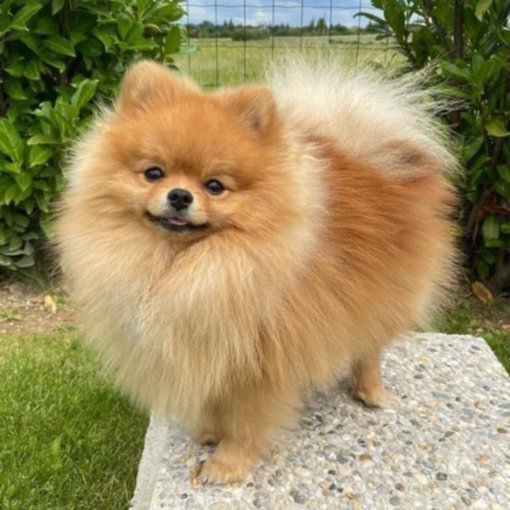

---

### 👩‍💻 Ricamae Azumbrado  
**IT Student · Flutter & Web Developer · Aspiring Full‑Stack Developer**

---

## 🚀 About Me

I'm **Ricamae**, an **IT student** who loves learning by building real projects.  
I enjoy working with **Flutter**, **web technologies**, and **databases**, and I use GitHub to track my growth as a developer.

- 🌱 Currently improving my **Flutter UI**, **web design**, and **database skills**
- 🧩 I like breaking big problems into small, clear steps
- 🎯 Long‑term goal: become a **full‑stack developer** who can build and deploy complete apps

---

## 🧰 Skills and Technologies

### Programming Languages

### Frontend Development

### Backend & Database

### Mobile Development

### Tools & Platforms

---

## 📱 Dog Breeds Identifier App

My featured mobile project is a **Dog Breeds Identifier**, built with **Flutter** and a **TensorFlow Lite model**.

- **Purpose**: Help users identify dog breeds quickly using their phone.
- **Core Features**:
  - 📷 **Scan & Identify** dog breeds from photos
  - 🧠 **On‑device ML model** using `.tflite` and `labels.txt`
  - 📊 **History & Analytics** to review previous scans
  - 🎨 **Modern, minimal UI** focused on clarity and ease of use

---

## 🖼️ App Screens (UI Preview)

| Home | Scan | History | Analytics |
|:----:|:----:|:-------:|:--------:|
|  |  |  |  |

---

## 🐶 Dog Breed Classes

| Breed | Preview | Description |
|:-----|:-------:|:------------|
| **Aspin** |  | A beloved **Filipino native dog**, known for its loyalty, intelligence, and unique mixed features. |
| **Bulldog** |  | A **calm, muscular companion** with a wrinkled face and strong build, often gentle and affectionate. |
| **Dalmatian** |  | Famous for its **white coat with black spots**, energetic and alert with a strong working‑dog history. |
| **German Shepherd** |  | A highly **intelligent and trainable** working dog, often used in police, rescue, and service roles. |
| **Golden Retriever** |  | Friendly and social, known for its **golden coat** and great temperament with families and kids. |
| **Labrador Retriever** |  | One of the most popular breeds; **loyal, playful, and versatile**, ideal as a family or service dog. |
| **Pomeranian** |  | A **small, fluffy companion dog** with a fox‑like face and lively personality. |
| **Poodle** |  | Very **smart and elegant**, known for its curly coat and versatility. |
| **Shih Tzu** |  | A **small, affectionate lap dog** with long hair, bred as a royal companion. |
| **Siberian Husky** |  | A **striking, energetic sled dog** with a thick coat and often blue or mixed‑color eyes. |

## 💼 Other Featured Projects

| Project | Description | Tech Stack | Repository |
|:--------|:------------|:-----------|:-----------|
| **Azumbrado_IT120_Act1** | Programming activities and exercises for IT120 | `Python` | [View Repo](https://github.com/razumbrado/Azumbrado_IT120_Act1) |
| **Azumbrado_IT108** | Web development activities and fundamentals | `HTML` `CSS` `JavaScript` | [View Repo](https://github.com/razumbrado/Azumbrado_IT108) |
| **Azumbrado_IT108_QUIZ** | Quiz and practice projects for IT108 | `Web` | [View Repo](https://github.com/razumbrado/Azumbrado_IT108_QUIZ) |
| **Flutter_Widget_UIComponents** | Reusable Flutter UI components and widgets | `Flutter` `Dart` | [View Repo](https://github.com/razumbrado/Flutter_Widget_UIComponents) |
| **mysql-trigger-implementation-azumbrado** | MySQL trigger implementation and automation | `MySQL` `Database` | [View Repo](https://github.com/razumbrado/mysql-trigger-implementation-azumbrado) |
| **Azumbrado_Esma_FinalProject** | Academic final project using multiple technologies | `Multiple Technologies` | [View Repo](https://github.com/razumbrado/Azumbrado_Esma_FinalProject) |

---

## 📊 GitHub Stats

<!-- Main stats -->

<!-- Top languages -->

<!-- Fixed GitHub streak card -->

---

## 🎯 Learning Roadmap

- 📱 Build more **Flutter** apps with better navigation and state management  
- ☁️ Connect apps to **Firebase** (auth & database)  
- 🌐 Improve **responsive web design** and UI/UX  
- 🗄️ Practice **database design** and more complex SQL queries  

---

✨ **Thanks for visiting my profile!**  
Feel free to explore my repositories and follow my journey:  
👉 [github.com/razumbrado](https://github.com/razumbrado)

